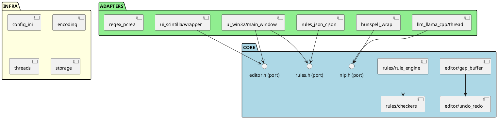

# ARCHITECTURE.md — IntelliEditor

> Ce document explique l'architecture hexagonale d'IntelliEditor.
> Il est conçu pour être lu, compris, et expliqué à l'oral lors de la soutenance.

---

## 1. Pourquoi une architecture hexagonale ?

### Le problème classique

Dans un projet mal structuré, la logique métier est mélangée à l'interface
graphique et aux détails techniques :

```c
// ❌ MAUVAIS : logique métier dans l'UI
case WM_KEYDOWN:
    // Compter les mots directement dans WndProc ???
    int words = 0;
    for (int i = 0; i < text_len; i++) {
        if (text[i] == ' ') words++;
    }
    // Appeler Hunspell directement dans le message handler ???
    Hunspell_spell(hh, current_word);
    break;
```

Conséquences : impossible à tester, impossible à modifier sans tout casser,
impossible à comprendre après 2 semaines.

### La solution : l'architecture hexagonale

Développée par Alistair Cockburn, elle dit :

> **Le cœur métier de l'application ne doit dépendre de rien d'externe.**
> L'UI, la base de données, le réseau — tout ça doit être à la périphérie,
> branché sur le cœur via des interfaces (ports).

---

## 2. Les trois couches d'IntelliEditor

```
╔══════════════════════════════════════════════════════════════════════╗
║                                                                      ║
║    ┌─────────────────────────────────────────────────────────┐       ║
║    │                      CORE (cœur)                        │       ║
║    │                                                         │       ║
║    │   editor/gap_buffer.c    → stockage du texte            │       ║
║    │   editor/undo_redo       → historique des actions       │       ║
║    │   rules/rule_engine.c    → évaluation des règles        │       ║
║    │   rules/checkers/        → vérificateurs métier         │       ║
║    │   nlp/ (interfaces)      → contrats NLP abstraits       │       ║
║    │                                                         │       ║
║    │   ✅ Aucune dépendance externe                          │       ║
║    │   ✅ 100% testable sans Windows                         │       ║
║    │   ✅ Code le plus stable et le plus important           │       ║
║    └─────────────────────────────────────────────────────────┘       ║
║                                                                      ║
║    ┌────────────────────┐  ┌──────────────────────────────────┐      ║
║    │   ADAPTERS (pont)  │  │   ADAPTERS (suite)               │      ║
║    │                    │  │                                  │      ║
║    │   ui_win32/        │  │   llm_llama_cpp/                 │      ║
║    │   ui_scintilla/    │  │   hunspell_wrap/                 │      ║
║    │                    │  │   rules_json_cjson/              │      ║
║    │   ✅ Connaît Core  │  │   regex_pcre2/                   │      ║
║    │   ✅ Connaît Infra │  │                                  │      ║
║    │   ❌ Pas de métier │  │   ✅ Branche libs externes       │      ║
║    └────────────────────┘  └──────────────────────────────────┘      ║
║                                                                      ║
║    ┌─────────────────────────────────────────────────────────┐       ║
║    │                     INFRA (fondations)                  │       ║
║    │                                                         │       ║
║    │   config_ini/   → lire/écrire config.ini               │       ║
║    │   encoding/     → conversion UTF-8 ↔ UTF-16            │       ║
║    │   threads/      → abstraction CreateThread Win32        │       ║
║    │   storage/      → lecture/écriture de fichiers          │       ║
║    │                                                         │       ║
║    │   ✅ Services purement techniques                       │       ║
║    └─────────────────────────────────────────────────────────┘       ║
║                                                                      ║
╚══════════════════════════════════════════════════════════════════════╝
```

---

## 3. La règle d'or des dépendances

```
CORE  ──►  (rien)
INFRA ──►  (rien, sauf Win32 pour les threads)
ADAPTERS ──►  CORE + INFRA + bibliothèques externes
```

**Ce qui est INTERDIT :**

```c
// ❌ Dans gap_buffer.c (CORE) :
#include <windows.h>          // Interdit ! Le core ne connaît pas Windows.
#include <hunspell/hunspell.h> // Interdit ! Le core ne fait pas de NLP.

// ❌ Dans main_window.c (ADAPTER) :
int words = 0;                 // Interdit ! La logique de comptage est dans le core.
for (...) if (c == ' ') words++;

// ❌ Dans rule_engine.c (CORE) :
cJSON *root = cJSON_Parse(...); // Interdit ! Le parsing JSON est dans l'adapter.
```

---

## 4. Les flux de données

### Flux 1 — L'utilisateur tape du texte

```
[Clavier]
   │
   ▼ WM_CHAR ou SCN_MODIFIED (Windows message)
[main_window.c — ADAPTER UI]
   │
   ▼ editor_insert(doc, char, 1)
[gap_buffer.c — CORE]
   │  (texte stocké dans le gap buffer)
   ▼ (après 2 secondes d'inactivité)
[ui_sync_text()]
   │
   ▼ SendMessage(SCI_SETTEXT, ...)
[Scintilla — ADAPTER]
   │
   ▼ [Affichage à l'écran]
```

### Flux 2 — Vérification des règles

```
[Fichier memoire_licence.json]
   │
   ▼ ruleset_load_from_file()
[rule_parser.c — ADAPTER rules_json_cjson]
   │  (parse le JSON avec cJSON)
   ▼ RuleSet *
[rule_engine.c — CORE]
   │
   ▼ rules_evaluate(set, texte, len)
   │  (appelle les checkers)
   ▼ RuleReport *
[main_window.c — ADAPTER UI]
   │
   ▼ ui_update_rules_panel(ctx, report)
   │
   ▼ [Panneau règles affiché]
```

### Flux 3 — Vérification LLM (asynchrone)

```
[Utilisateur demande vérification grammaire]
   │
   ▼ llm_submit_request(engine, LLM_TASK_GRAMMAR_CHECK, prompt, callback, ctx)
[llm_thread.c — ADAPTER llm_llama_cpp]
   │  (requête ajoutée à la file)
   │  (retour IMMÉDIAT — UI non bloquée)
   │
   │  ... [5-30 secondes plus tard, dans le thread worker] ...
   │
   ▼ llama_eval(...) → réponse générée
   │
   ▼ callback(&response, ctx)
   │  (PostMessage vers la fenêtre principale)
   │
   ▼ WM_LLM_RESPONSE dans WndProc
[main_window.c — ADAPTER UI]
   │
   ▼ Mise à jour des marqueurs NLP dans Scintilla
```

---

## 5. Les ports et adapters

Le concept **ports & adapters** est au cœur de l'architecture hexagonale.

Un **PORT** est une interface définie dans le Core (dans `include/`) :

```c
// include/nlp.h — PORT NLP
// Le core définit CE QU'IL VEUT, pas COMMENT c'est fait.
bool spellcheck_word(const SpellChecker *sc, const char *word);
void spellcheck_suggest(const SpellChecker *sc, const char *word,
                         NlpSuggestion suggestions[], size_t *count);
```

Un **ADAPTER** est l'implémentation concrète de ce port :

```c
// adapters/hunspell_wrap/hunspell_wrap.c — ADAPTER Hunspell
// Implémente le port en utilisant Hunspell.
bool spellcheck_word(const SpellChecker *sc, const char *word) {
    return Hunspell_spell(sc->hunspell_handle, word) != 0;
}
```

Avantage : on pourrait remplacer Hunspell par un autre dictionnaire
**sans toucher au Core**. Il suffit d'écrire un nouvel adapter.

---

## 6. Les structures de données clés

### GapBuffer — le cœur de l'éditeur

```
Texte "Hello World" avec curseur après "Hello" :

  buf:  [ H | e | l | l | o | _ | _ | _ | _ | _ | W | o | r | l | d ]
         0   1   2   3   4   5   6   7   8   9  10  11  12  13  14
                                  ^                 ^
                              gap_start=5       gap_end=10

  Longueur du texte = capacity - (gap_end - gap_start)
                    = 15 - 5 = 10 octets

  Insérer " " (espace) → écrire dans buf[gap_start], gap_start++
  Supprimer ← → gap_start--
```

### RuleSet → RuleReport — le moteur de règles

```
Fichier JSON
    │
    ▼ (rule_parser.c)
RuleSet {
  rule_count = 9
  rules[] = [
    Rule { id="R001", check_type=CHECK_SECTION_EXISTS, parameter="Introduction" },
    Rule { id="R002", check_type=CHECK_SECTION_EXISTS, parameter="Conclusion" },
    ...
  ]
}
    │
    ▼ rules_evaluate(set, texte, len)
RuleReport {
  result_count = 9
  results[] = [
    RuleResult { rule_id="R001", status=STATUS_PASS,    message="Trouvée" },
    RuleResult { rule_id="R002", status=STATUS_FAIL,    message="Manquante" },
    RuleResult { rule_id="R009", status=STATUS_PENDING, message="LLM en attente..." },
    ...
  ]
  pass_count    = 5
  fail_count    = 2
  warning_count = 1
  pending_count = 1
}
```

### File de requêtes LLM — le thread asynchrone

```
Thread UI (principal)          Thread LLM Worker
─────────────────────          ─────────────────
submit(req1) ──────────────►   [req1, req2, req3]  ← queue[3 slots utilisés]
submit(req2) ──────────────►         │
submit(req3) ──────────────►         ▼ dépile req1
(continue, non bloqué)         llama_eval(req1.prompt)
                                     │ (peut prendre 20 secondes)
                                     ▼
                               callback(response1) → PostMessage(WM_LLM_RESPONSE)
                                     │
                                     ▼ dépile req2
                               ...
```

---

## 7. Diagramme PlantUML (à utiliser dans votre rapport)



---

## 8. Ce qui change quand on complète les stubs

Chaque TODO dans le code correspond à une "brique" à poser dans cet édifice.
L'architecture est conçue pour que chaque brique soit indépendante :

- DEV-A peut implémenter le gap buffer sans attendre DEV-B
- DEV-B peut tester l'UI avec des stubs qui retournent de fausses données
- DEV-C peut travailler sur le thread LLM sans attendre DEV-D
- DEV-D peut écrire les tests avant même que les fonctions soient implémentées

C'est le **vrai pouvoir de l'architecture hexagonale** : elle permet le travail en parallèle.
